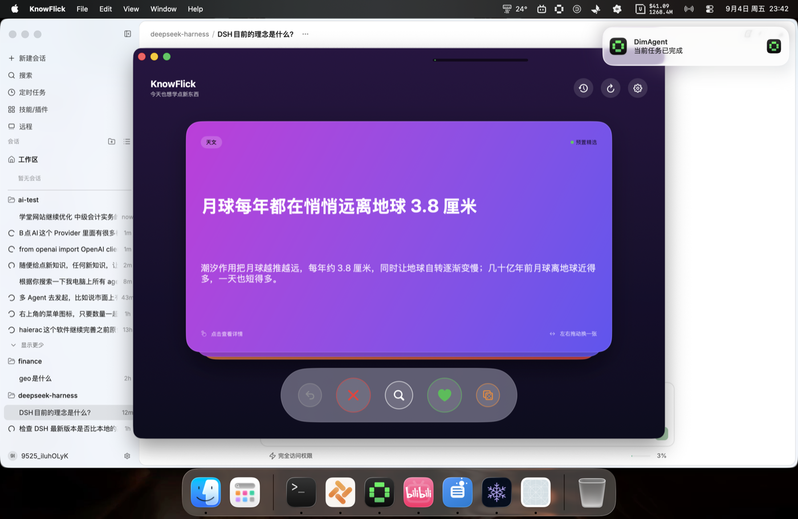

# KnowFlick

<div align="center">

**macOS 领域知识卡片应用 — 打开即学，左右划卡**

[](https://github.com/bitterSmilezzz/knowflick)
[](https://github.com/bitterSmilezzz/knowflick)
[](https://github.com/bitterSmilezzz/knowflick)
[](LICENSE)
[](https://github.com/bitterSmilezzz/knowflick/releases)



</div>

---

KnowFlick 是一个用 SwiftUI 编写的 macOS 桌面应用（最低支持 macOS 14），采用「卡片 + 手势」的方式快速刷**你关心的领域知识**：每次随机展示一张知识卡片，左划/右划跳过或标记，按 `⏎` 展开详情和来源链接，历史记录自动保留。分类体系由你掌控——内置「冷知识」库之外，可以自定义分类（如 AI、AI 开发、AI Agent、中级会计、投资理财），AI（DeepSeek 等 OpenAI 兼容端点）按分类内容方向自动生成新卡。

## 功能

- **暗色人文画报风（Dark Editorial）**：以原生宋体（Songti SC Black）为主标题字模，辅以高透气衬线正文排版，多阶非线性动态遮罩（DynamicScrim），带来沉浸式出版物级阅读质感
- **千卡千面智能背景与动态光晕**：内置 21 套精选科学与人文摄影底图，基于标题与摘要关键词智能识别领域（物理、天文、生物、化学、历史、心理、脑科学、AI、架构、Rust等），未命中自动按标题哈希均匀分散，彻底告别单调雷同；主窗体环境光晕随顶卡与划卡飞出动画实时流转
- **触觉与 3D 动力学**：macOS 触控板震动实体反馈（达阈值震动、松手磁吸回弹、刷卡确认）；手势 1:1 跟手与 3D 俯仰透视；底层卡片平滑上浮放大，极速丝滑无闪烁（Flying Card Overlay）
- **原生应用图标**：黑曜石磨砂底盘与琥珀金「K」卡片交叠，完美契合 macOS Sonoma / Sequoia 超椭圆原生规范
- **随机刷卡**：从本地卡片库随机抽取，左右划快速浏览
- **详情 + 链接**：按 `⏎` 展开水墨晕染大图与详情、查看卡片化来源链接；详情页内可连续刷卡（点操作自动切下一张，`←`/`→` 直接切换）
- **历史记录**：自动保存浏览历史，图文画报流卡片呈现，随时回看（支持按感兴趣/不喜欢筛选）
- **撤销**：`⌘Z` 撤销上一张卡片
- **分类自定义**：设置页可增删改分类（名称 + 内容方向描述，支持分类专属色微标预览），内置「冷知识」分类收纳预置知识库；AI 生成按每个分类的内容方向产出对应领域卡片
- **主流 AI 服务商一键预设**：内置 DeepSeek、硅基流动 (SiliconFlow)、Kimi (月之暗面)、智谱 GLM、OpenAI、本地私有 Ollama，自动补全 Base URL 与热门模型，只需填入 Key 即可使用（Ollama 免填 Key），同时支持「自定义」模式连接任意兼容端点
- **AI 智能生成**：卡片不足或想开拓新领域时自动补充新卡；流式生成、够数即停，自动做分类规范化与近重复去重
- **知识库增量合并与重置**：应用更新时自动同步新增的种子知识卡片，老用户无缝获取扩充内容；设置页实时显示卡库探索进度，支持一键重置卡堆重新体验
- **来源配置**：设置页可分别开关「预置精选库」与「AI 生成内容」两种信息来源，并配置 AI 引用站点偏好（生成内容与检索链接都优先这些站点）
- **AI 内容标记**：AI 生成的卡片在正面显示橙色徽章、详情页显示核实提示条，可一键关闭
- **偏好过滤**：设置里多选偏好分类，刷卡队列优先偏好分类，刷完自动回退其他分类
- **学习统计**：杂志专栏风呈现——已刷/感兴趣率/连续天数 + 分类双轨条形图 + 近 7 天渐变趋势柱状图
- **健壮模态路由**：采用单一状态入口模态调度（ActiveSheet），彻底根治 macOS SwiftUI 多弹窗覆盖失效

## 键盘快捷键

| 快捷键 | 功能 |
| --- | --- |
| `←` / `→` | 左右划卡（上一张 / 下一张） |
| `⏎` | 展开 / 关闭详情 |
| `⌘Z` | 撤销上一张 |
| `⌘N` | 生成一张新卡（需配置 AI） |
| `Esc` | 关闭详情 / 历史 / 设置 |
| `⌘?` | 快捷键帮助 |

详情页内：

| 快捷键 | 功能 |
| --- | --- |
| `←` / `→` | 切换上一张 / 下一张详情 |
| `⏎` / `Esc` | 关闭详情 |
| `⌘Z` | 撤销上一张 |

## 下载安装

从 [Releases](https://github.com/bitterSmilezzz/knowflick/releases) 页面下载最新 `KnowFlick.app.zip`，解压后拖入「应用程序」即可。

> 提示：未签名应用首次打开时，若被 Gatekeeper 拦截，请在「系统设置 → 隐私与安全性」中点击「仍要打开」；或执行 `xattr -dr com.apple.quarantine /Applications/KnowFlick.app`。

## 构建与运行

### 直接运行（开发）

```bash
cd KnowFlick
swift run
```

### 打包成 .app

```bash
cd KnowFlick
./build_app.sh
```

脚本会执行 `swift build -c release`，并把可执行文件、`Info.plist` 和资源 bundle 手工组装为 `dist/KnowFlick.app`（无需 Xcode 工程）。

### 安装使用

- 双击 `dist/KnowFlick.app` 直接运行；或
- 把它拖到 `/Applications` 后从「启动台」/「应用程序」打开

## AI 服务配置（开箱即用）

在应用内点击右上角「偏好设置」（齿轮图标），在「AI 驱动服务」卡片中选择服务商预设（已按分类组织，并已全面补充本机常用 Agent 供应商）：

### 1. 主流公有云平台
| 服务商预设 | 默认 Base URL | 推荐模型 | 说明 |
| --- | --- | --- | --- |
| **DeepSeek (官方)** | `https://api.deepseek.com` | `deepseek-chat`, `deepseek-reasoner` | 官方高性价比模型，填入 API Key 即可 |
| **硅基流动 (SiliconFlow)** | `https://api.siliconflow.cn/v1` | `deepseek-ai/DeepSeek-V3`, `Qwen/Qwen2.5-7B-Instruct` | 汇聚主流满血大模型，填入 Key 即可 |
| **Kimi (月之暗面)** | `https://api.moonshot.cn/v1` | `moonshot-v1-8k`, `moonshot-v1-32k` | 长文本与中文常识理解，填入 Key 即可 |
| **智谱 GLM / BigModel** | `https://open.bigmodel.cn/api/paas/v4` | `glm-4-flash`, `glm-4-plus`, `glm-5.2` | 智谱 AI 开放平台，填入 Key 即可 |
| **阿里云百炼 (通义千问)** | `https://dashscope.aliyuncs.com/compatible-mode/v1` | `qwen-plus`, `qwen-max`, `qwen-turbo` | 阿里云 DashScope OpenAI 兼容端点 |
| **OpenAI (官方)** | `https://api.openai.com/v1` | `gpt-4o-mini`, `gpt-4o` | 官方 GPT 系列端点，填入 Key 即可 |

### 2. 本机 Agent 专线与聚合中转
| 服务商预设 | 默认 Base URL | 推荐模型 | 说明 |
| --- | --- | --- | --- |
| **OpenCode Go** | `https://opencode.ai/zen/go/v1` | `deepseek-v4-flash`, `glm-5.2`, `kimi-k3` | OpenCode 开发者中转，汇聚主流前沿模型 |
| **基元律动 (TokenRhythm)** | `https://tokenrhythm.studio/v1` | `deepseek-v4-flash`, `glm-5.2`, `qwen3.8-max` | TokenRhythm 高并发聚合平台 |
| **小米 MiMo (Xiaomi)** | `https://api.xiaomimimo.com/v1` | `mimo-v2.5`, `mimo-v2.5-pro` | 小米大模型开放平台端点 |
| **LongCat (长猫科技)** | `https://api.longcat.chat/openai` | `LongCat-2.0` | 长猫科技大模型服务端点 |
| **蚂蚁百灵 (AntDigital)** | `https://maas-api.antdigital.com/v1` | `ling-3.0-flash-fin`, `deepseek-v4-flash` | 蚂蚁数科百灵大模型平台 |
| **NVIDIA NIM** | `https://integrate.api.nvidia.com/v1` | `deepseek-ai/deepseek-v4-flash-0731` | 英伟达开发者微服务平台 |
| **AMD 开发者平台** | `https://developer.amd.com.cn/radeon/api/v1` | `DeepSeek-V4-Flash`, `Qwen3.8-Flash-Next` | AMD 开发者中心开源端点 |

### 3. 本地与离线服务
| 服务商预设 | 默认 Base URL | 推荐模型 | 说明 |
| --- | --- | --- | --- |
| **Ollama (本地私有)** | `http://localhost:11434/v1` | `qwen2.5:7b`, `deepseek-r1:7b`, `llama3.1:8b` | 本地私有离线运行，**无需 API Key** |
| **本地代理网关 (:31415)** | `http://127.0.0.1:31415/v1` | `auto`, `fusion`, `gemini-3.6-flash` | 本机聚合网关端口，**无需 API Key** |

### 4. 自定义
| 服务商预设 | 默认 Base URL | 推荐模型 | 说明 |
| --- | --- | --- | --- |
| **自定义服务商** | 自定义端点地址 | 自定义模型名 | 适配任意第三方 OpenAI 兼容端点或中转站 |

- **安全存储**：API Key **绝不写入本地明文 JSON 文件**，只存入 macOS 原生钥匙串（Keychain）中。
- **即选即用**：切换预设时，Base URL 与推荐模型列表自动联动填入，免去查文档与手动输入的不便。
- **连通性测试**：配置完成后可点击「测试连通性」一键校验端点与密钥是否工作正常。
- **自定义分类与偏好**：设置面板中可增删改分类、多选偏好分类，并可设置 AI 优先引用的权威信源站点。

## 数据存储

| 内容 | 位置 |
| --- | --- |
| 卡片数据（含历史） | `~/Library/Application Support/KnowFlick/cards.json` |
| AI 设置（base_url / model） | `UserDefaults`（`com.knowflick.app`） |
| AI 密钥 | macOS 钥匙串（Keychain） |

内置种子知识库（214 张）随 app 打包在资源 bundle 中（`Contents/Resources/KnowFlick_KnowFlickCore.bundle/seed_cards.json`）：
- **冷知识（160 张）**：通识（物理/生物/天文/数学/化学/历史/心理/脑科学/语言/科技/生活/地理）+ 技术向（AI/算法/数据结构/架构/Rust/Python/编程）+ 备考向（中级会计/学习方法），全部并入内置「冷知识」分类
- **AI（10 张）/ AI 开发（10 张）/ AI Agent（9 张）/ 中级会计（12 张）/ 投资理财（13 张）**：领域初始卡，覆盖机器学习原理、提示工程与 RAG、Agent 架构、会计实务、理财基础

卡片背景图来自 [Unsplash](https://unsplash.com)（Unsplash License，可免费商用），已做压暗与底部渐变处理以保证文字可读性；自定义分类自动复用内置视觉资源（按分类名稳定映射）。

## 项目结构

```
KnowFlick/
├── Package.swift            # SwiftPM 清单（macOS 14+）
├── build_app.sh             # 打包脚本 → dist/KnowFlick.app
├── CHANGELOG.md             # 完整版本更新日志
├── Resources/               # 原生应用图标（AppIcon.icns / AppIcon.png）
├── Sources/
│   ├── KnowFlick/           # 应用层
│   │   ├── KnowFlickApp.swift   # 应用生命周期入口
│   │   └── Views/               # 刷卡、详情、历史、设置、设计系统 Token、触觉辅助
│   └── KnowFlickCore/       # 核心业务逻辑（独立跨平台/可测）
│       ├── Models/              # 卡片 / 分类 / AI 设置模型
│       ├── Services/            # AI 服务、钥匙串存取
│       ├── Stores/              # AppStore 应用状态、卡片持久化
│       ├── Stats/               # 纯函数统计与趋势计算
│       └── Resources/           # seed_cards.json（种子卡数据）与分类底图
└── dist/KnowFlick.app       # 打包产物（由 build_app.sh 生成）
```

## 更新日志

详见 [CHANGELOG.md](CHANGELOG.md) 查看完整的版本迭代与演进记录。

## 技术说明

- 纯 SwiftPM 工程，无 Xcode 工程文件；`swift build -c release` 即可编译
- 双 target 结构：`KnowFlickCore`（模型/服务/存储/统计，可测试）+ `KnowFlick`（App 入口与视图）+ `KnowFlickCoreTests`
- 使用 `Bundle.module` 加载内置资源（seed_cards.json），背景图经 ImageIO 降采样解码缓存
- 目标平台：macOS 14.0+（Apple Silicon / Intel 均可）
