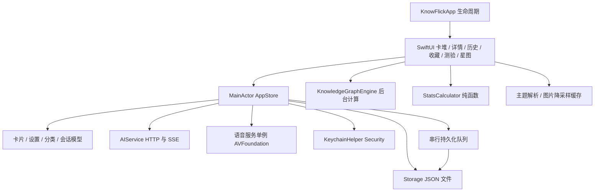

# KnowFlick 全项目分析与优化报告

**Mode:** Full Sweep  
**日期:** 2026-09-08  
**Scope:** 34 个 Swift 源文件、7 个 Swift 测试文件、课程导入与构建脚本、包配置、文档和 214 张种子卡。  
**Health Score:** 8 → 79 / 100（按下列 16 个问题组估算；是维护风险评分，不是覆盖率或无缺陷证明）。

项目的双模块结构清楚，原生界面和卡片领域模型能够继续沿用。当前最需要解决的是数据可靠性、异步生命周期与测试保障，而非整体重写。此次保留工作区原有及执行期间出现的追问功能改动，没有提交、推送或修改用户真实卡库。

## 架构与数据流



- SwiftPM 依赖为 `KnowFlick → KnowFlickCore`，未发现 target 循环依赖，没有外部包依赖。
- Core 中的模型、统计、主题规则较容易测试；但 Core 依赖 AVFoundation / Security，不能把它描述为可直接跨平台运行。
- 图片缓存已有容量限制与 ImageIO 降采样，保留这些有效设计。
- 历史是卡片上的最新浏览时间，不是独立事件日志；反复浏览同一卡会改变历史和统计，未擅自改变这一领域语义。
- 种子库 214 张、6 类，标题无重复；未修改种子内容，也未对其中知识事实做外部核验。

## Dimension Summary

| Dimension | 检查范围 | 本轮处理 | 遗留重点 |
|---|---|---|---|
| Review R1–R6 | 状态、存储、网络、语音、视图调用路径 | 编译、密钥、恢复、取消、过滤等缺陷 | 文件错误通道、共享语音依赖 |
| Test T1–T6 | 原有 4 文件及新增 3 文件 | 保留 48 个原有测试场景，新增 22 个 Swift 场景，迁移 Swift Testing；另加 3 个 Python 测试 | 原生界面、真实系统服务与异常网络时序 |
| Debt | 重复协议规则、过期脚本与说明 | HTTP 请求统一、导入幂等、README 与测试入口更新 | CONTEXT 文档仍有旧规则 |
| Audit | 2 个生产 target 的依赖与耗时路径 | 星图分词复用、后台计算、Sendable 值模型、写盘串行化 | AppStore 职责过多 |

## Findings 与 Fix Log

以下为已落实的 11 个问题组；一个组可能涉及多个相关缺陷。

### F1 · Critical · R5：密钥实际进入 JSON

**Symptom:** `AISettings` 自动合成的编码包含 `apiKey`，`saveSettings` 把该对象直接写入文件，违反 README 的安全存储承诺。Keychain 更新还采用先删后加，后续写入失败会丢失旧值。  
**Source:** *Clean Architecture* — policy/detail boundary；*Code Complete* — Defensive Programming。  
**Consequence:** 明文文件可包含凭据；更新失败可能破坏已有凭据。  
**Remedy / applied:** 明确实现不含密钥的编码；启动时在钥匙串可读或迁移成功后清除旧 JSON 中的密钥；Keychain 优先原位更新。测试直接断言编码及落盘均不包含模拟密钥。真实 Keychain 迁移没有在本次验证中执行。

### F2 · Critical · R2：新增追问调用无法编译

**Symptom:** 引用了 `KnowledgeCard.sources` 和私有的 `speakRawText`。  
**Source:** *Code Complete* — Construction Prerequisites / Interface Consistency。  
**Consequence:** 当前工作区无法生成可执行应用。  
**Remedy / applied:** 使用实际的 `links`；提供管理播放状态的 `speakResponse` 入口，视图通过该入口朗读回复。

### F3 · Warning · R2：备份恢复和退出保存存在缺口

**Symptom:** 首次保存没有备份；恢复时可能把损坏主文件轮转成备份；bootstrap 只检查主文件存在性；多个 detached 写入可能重叠，且进程退出不会等待它们。  
**Source:** *Code Complete* — Defensive Programming；*The Pragmatic Programmer* — Orthogonality。  
**Consequence:** 首次保存或再次损坏时无法恢复，最后一次刷卡也可能丢失。  
**Remedy / applied:** 仅备份可解码的健康旧文件，首次写入建立备份；启动直接尝试三级恢复；防抖后按串行队列落盘；应用正常退出前同步 flush。回归覆盖连续恢复、缺主文件、即时保存与撤销。强制杀进程仍无法保证防抖窗口内的数据保存。

### F4 · Warning · R6：卡堆派生状态不一致

**Symptom:** 来源全关仍留下 AI 卡；保留队列顺序时保留的是旧卡片值，测验结果不会更新到卡堆；详情收藏状态保存在独立 State。  
**Source:** *Domain-Driven Design* — Aggregate Invariants；*The Pragmatic Programmer* — DRY。  
**Consequence:** 来源开关和掌握度显示与真实状态不一致，连续切详情时收藏标识可能滞后。  
**Remedy / applied:** 按卡片来源独立判断两个开关；保序时从当前卡库取最新值；详情收藏从 store 派生。测试覆盖来源四种组合、偏好耗尽回退、撤销与掌握度同步。

### F5 · Warning · R3：AI 请求规则重复且行为有误

**Symptom:** 三套 URL 拼接都只认识 `/v1`；本地预设虽然宣称免密钥，服务和界面仍强制要求 key；去重只检查提示词前 100 个标题；重试吞掉取消异常。  
**Source:** *The Pragmatic Programmer* — DRY；*A Philosophy of Software Design* — Information Leakage。  
**Consequence:** 自定义 API 前缀被错误追加路径，本地服务不能使用，已有卡可能重复生成，取消后可能继续重试。  
**Remedy / applied:** 统一请求构建；保留自定义 API 路径；环回主机支持空密钥且不发送空 Authorization；提示词仍截断但本地去重检查全量；取消可传播，提前结束显式取消传输。关键词查询改用 URLQueryItem，避免 `&` / `#` 改变查询含义。URLProtocol 测试验证真实服务代码的 ping、SSE 和第 101 条去重路径，没有请求真实供应商。

### F6 · Warning · R2：追问取消污染新会话

**Symptom:** 切卡未先保存并取消旧会话；旧任务结束后会改共享 streaming 状态；取消保存的是更新前的会话副本；异常后没有持久化问题及已有回答。  
**Source:** *Code Complete* — State Management；*The Pragmatic Programmer* — Orthogonality。  
**Consequence:** 新会话可能提前解锁发送，空占位残留，用户消息丢失。  
**Remedy / applied:** 切换先取消保存；拒绝并发发送；取消任务不能执行完成收尾；去除空占位并保存修改后的副本；异常保留已有内容；视图消失时关闭会话；空响应明确报错。

### F7 · Warning · R4：星图反复分词并阻塞界面

**Symptom:** 每一对卡片都重新提取两次全文关键词；构图在主线程；节点 ID 每次随机生成，亲和规则只有单向查询。  
**Source:** *A Philosophy of Software Design* — Complexity；*Code Complete* — Performance Measurement。  
**Consequence:** 数百张卡时构图明显拖慢交互，同一数据重绘的身份不稳定，关系受输入顺序影响。  
**Remedy / applied:** 每张卡只提取一次关键词，关系比较复用集合；异步构图并支持取消，提供等待提示；使用卡片身份与稳定散布；双向检查亲和关系；关键词解释排序稳定化。

### F8 · Warning · R2：语音旧回调覆盖新播放状态

**Symptom:** 异步 delegate 回调未检查当前 utterance；无中文语音时强制解包；间隔转换为 UInt64 未验证负数和非有限值。  
**Source:** *Code Complete* — Defensive Programming。  
**Consequence:** 旧朗读取消事件可能把新朗读设为空闲，异常系统语音或设置可能造成崩溃。  
**Remedy / applied:** 回调核对 utterance 身份；允许系统默认声音兜底；转换前限制间隔。编译通过；真实发声及系统回调顺序仍需要人工验证。

### F9 · Warning · T5：关键状态与传输缺少可执行测试

**Symptom:** 原有用例集中在纯解析、分类和统计，没有 AppStore / 星图 / HTTP 传输测试；本机 Command Line Tools 无 XCTest。  
**Source:** *Working Effectively with Legacy Code* — Seams；*How Google Tests Software* — Change Coverage。  
**Consequence:** 文件恢复、来源过滤等可见问题未被保护，测试入口在当前环境不可执行。  
**Remedy / applied:** 迁移为 Swift Testing 并保留原有场景，新增状态和传输用例；测试脚本处理 Command Line Tools 的框架及运行库路径。SwiftPM 工具版本升至 6.0，应用仍使用 Swift 5 语言模式、部署到 macOS 14+。

### F10 · Warning · R3：课程导入与打包规则过期

**Symptom:** 导入默认路径指向已搬迁的资源目录，分类仍是旧体系，重复执行重复追加；打包缺种子资源只警告，签名失败被吞掉。  
**Source:** *The Pragmatic Programmer* — DRY；*Software Engineering at Google* — Sustainability。  
**Consequence:** 维护者按默认命令导入失败或污染数据，打包表面成功但产物不可用。  
**Remedy / applied:** 修正路径和分类、标题去重实现幂等导入；打包前强制验证种子资源并校验签名。Python 测试覆盖重复导入与原卡保留。

### F11 · Suggestion · R6：数量参数缺少边界检查

**Symptom:** 负数测验、关联卡和趋势窗口可构造非法范围；生成数量可能导致整数溢出或极大请求。  
**Source:** *Code Complete* — Defensive Programming。  
**Consequence:** 异常调用或未来界面参数变更可能直接崩溃。  
**Remedy / applied:** 非正查询数量返回空集合；AI 批量生成限定 1–20 张，发送前校验。新增边界回归。

## 性能证据

使用仓库前 80 张真实种子卡，Swift `-O` 编译，在同一进程各运行 3 次取中位数，对照 `6c5db43` 的原始星图引擎：

| 场景 | 优化前 | 优化后 | 比值 |
|---|---:|---:|---:|
| 星图构建，80 张卡 | 3.400 秒 | 0.372 秒 | 9.13 倍 |

测量的是构图函数，不是整应用启动或全库的性能保证。算法仍需两两比较，为 O(n²)；后台执行改善响应性，但千卡以上仍应考虑限制候选集或建立倒排索引。

## 验证记录

- `./tools/test.sh --disable-sandbox`：70 个 Swift 测试、9 个 suite 全部通过；原有 48 个场景保留。
- `python3 -m unittest discover -s tools -p 'test_*.py'`：3 个测试通过。
- Release 构建及 `.app` 打包通过；`codesign --verify --deep --strict`、Info.plist 与种子资源检查通过。产物为 `dist/KnowFlick.app`（本地 ad-hoc 签名，不是公证发布）。
- `git diff --check`、两个 shell 脚本语法检查通过。
- 种子库检查：214 张，标题无重复。
- 环境仍提示用户级 SwiftPM 缓存不可写；不影响编译和测试，测试脚本把编译模块缓存放在临时目录。
- 没有进行真实在线 AI、真实 Keychain 迁移、发声、触觉、VoiceOver、窗口与海报导出交互验证；编译和单元测试不能替代这些验证。

## Residual Items（5 个）

### Warning · R1：AppStore 仍承担过多职责

**Symptom:** 一个类型同时管理卡库、会话、网络、测验、导出、语音与持久化。  
**Source:** *Refactoring* — Divergent Change；*A Philosophy of Software Design* — Deep Modules。  
**Consequence:** 新功能容易共享生命周期标志，跨功能回归成本高。  
**Remedy:** 下一阶段先将会话生命周期封装为独立控制器，再提取导出与测验策略，保持 AppStore 为协调入口。  
**Not applied because:** 大范围职责及模块边界调整应单独设计并分步验证，不适合和本次可靠性修复混在一起。

### Warning · R5：语音单例与应用状态耦合

**Symptom:** 每个 AppStore 初始化时都改写共享语音服务的回调和设置。  
**Source:** *Clean Architecture* — Dependency Inversion；*Working Effectively with Legacy Code* — Seams。  
**Consequence:** 多 store 或多窗口扩展会互相影响，系统语音测试难以隔离。  
**Remedy:** 明确应用级语音所有权，为 AppStore 注入可替换语音接口。  
**Not applied because:** 需要改变服务边界，并验证播放与窗口生命周期。

### Warning · T5：原生交互和故障时序仍有测试缺口

**Symptom:** 现有回归不覆盖完整窗口操作、真实音频、磁盘写失败、全部 429/5xx 退避和快速切换请求时序。  
**Source:** *How Google Tests Software* — Risk-Based Testing；*xUnit Test Patterns* — Test Portfolio。  
**Consequence:** 测试全绿不能证明这些系统边界没有回归。  
**Remedy:** 建立最小 macOS UI smoke suite，再补可控时钟与故障注入测试。  
**Not applied because:** 需要新的系统交互和可控时序测试设施；当前仅安装 Command Line Tools。

### Warning · R2：部分持久化失败仍没有用户可见通道

**Symptom:** settings / chat 的部分写盘使用 `try?`，cards 失败仅 NSLog；聊天仍同步读写全量会话文件。  
**Source:** *Code Complete* — Error Handling；*The Art of Unit Testing* — Test Completeness。  
**Consequence:** 磁盘不可写时 UI 可能表现为已保存；会话文件很大时可能拖慢主线程。  
**Remedy:** 将存储结果统一为可观察错误，按会话粒度保存并串行调度后台 IO；同时增加失败注入测试。  
**Not applied because:** 涉及公开存储接口与所有调用方的错误语义，需要独立迁移。

### Suggestion · R3：领域说明仍有过期承诺

**Symptom:** CONTEXT.md 同时描述当前自定义分类和旧 21 分类；主题说明中有“严格无碰撞”的绝对表述，算法在同图候选不足时实际上只能尽力排布；README 也仍有相似宣传语。  
**Source:** *Domain-Driven Design* — Ubiquitous Language；*The Mythical Man-Month* — Conceptual Integrity。  
**Consequence:** 后续维护者可能按不存在的规则实现功能或测试。  
**Remedy:** 专门校准领域契约，明确最小图距的可行条件、追加批次的边界与真实的统计口径。  
**Not applied because:** 应先确定领域契约，避免把本轮实现细节直接写成产品承诺。

本轮没有强行重排模块或更改历史记录语义。[brooks-sweep 指南](/Users/fangshoufanji/.agents/skills/brooks-sweep/sweep-guide.md) 对架构修改的规则是：“Do not auto-refactor module layouts, rename packages, or change public exports.” 上述结构性事项按该规则保留为后续设计工作，不影响已落实的修复。

## Iteration History

1. 初始风险定位：确认编译失败、XCTest 环境不可用和关键状态缺陷；先修复编译，再建立可执行测试入口。
2. Review / Test / Debt / Audit：落实 11 个问题组；70 个 Swift 测试与 3 个 Python 测试通过。
3. 消费方复查：补齐后台构图取消、值模型 Sendable、详情收藏派生状态和发布打包验证。未进行大规模模块重构；剩余 5 项明确保留。

## Summary

共记录 16 个问题组，落实 11 个，保留 5 个。估算评分按 balanced 权重计算：已修复 2 Critical、8 Warning、1 Suggestion；剩余 4 Warning、1 Suggestion，因此为 8 → 79。无三次修复失败后退休的问题。

## Scope 文件清单

```text
Sources/KnowFlick/KnowFlickApp.swift
Sources/KnowFlick/Views/AmbientAudioPlayerBar.swift
Sources/KnowFlick/Views/CardDeckView.swift
Sources/KnowFlick/Views/CardFollowUpChatView.swift
Sources/KnowFlick/Views/CardPosterExportSheet.swift
Sources/KnowFlick/Views/CardPosterRenderer.swift
Sources/KnowFlick/Views/CardSheenOverlay.swift
Sources/KnowFlick/Views/CardView.swift
Sources/KnowFlick/Views/CategoryTheme.swift
Sources/KnowFlick/Views/DetailView.swift
Sources/KnowFlick/Views/FavoritesView.swift
Sources/KnowFlick/Views/HapticFeedbackHelper.swift
Sources/KnowFlick/Views/HelpView.swift
Sources/KnowFlick/Views/HistoryView.swift
Sources/KnowFlick/Views/KnowledgeGraphView.swift
Sources/KnowFlick/Views/PosterExportManager.swift
Sources/KnowFlick/Views/QuizCardView.swift
Sources/KnowFlick/Views/QuizView.swift
Sources/KnowFlick/Views/SettingsView.swift
Sources/KnowFlick/Views/StatsView.swift
Sources/KnowFlick/Views/ThemeTokens.swift
Sources/KnowFlickCore/Models/AISettings.swift
Sources/KnowFlickCore/Models/CardChatMessage.swift
Sources/KnowFlickCore/Models/CategoryRegistry.swift
Sources/KnowFlickCore/Models/KnowledgeCard.swift
Sources/KnowFlickCore/Models/KnowledgeGraphEngine.swift
Sources/KnowFlickCore/Services/AIService.swift
Sources/KnowFlickCore/Services/KeychainHelper.swift
Sources/KnowFlickCore/Services/SpeechSynthesizerService.swift
Sources/KnowFlickCore/Stats/StatsCalculator.swift
Sources/KnowFlickCore/Stores/AppStore.swift
Sources/KnowFlickCore/Stores/Storage.swift
Sources/KnowFlickCore/Support/CoreResources.swift
Sources/KnowFlickCore/Theme/CardThemeResolver.swift
Tests/KnowFlickCoreTests/AIServiceTests.swift
Tests/KnowFlickCoreTests/AITransportTests.swift
Tests/KnowFlickCoreTests/AppStoreTests.swift
Tests/KnowFlickCoreTests/CategoryRegistryTests.swift
Tests/KnowFlickCoreTests/KnowledgeGraphTests.swift
Tests/KnowFlickCoreTests/StatsCalculatorTests.swift
Tests/KnowFlickCoreTests/StorageTests.swift
tools/import_lessons.py
tools/test.sh
tools/test_import_lessons.py
Package.swift
build_app.sh
README.md
CONTEXT.md
CHANGELOG.md
Sources/KnowFlickCore/Resources/seed_cards.json
```
