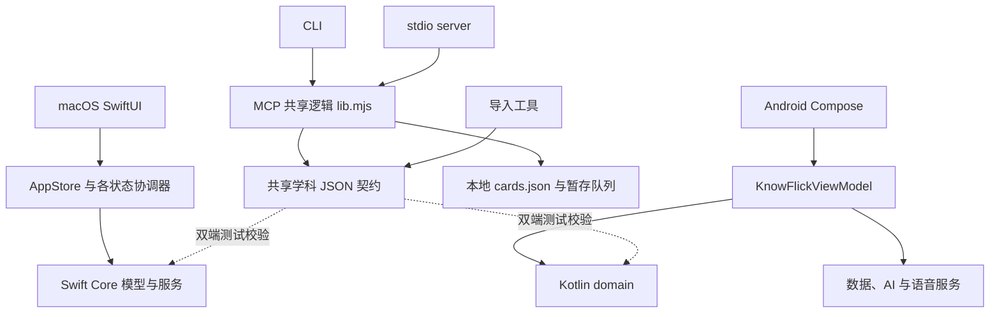

# KnowFlick 现状与本轮优化（2026-09-22）

**Mode:** Health Dashboard  
**Scope:** 全仓结构、当前未提交改动与测试布局的轻量扫描；深入核查本地 MCP/CLI 接入层。非逐文件完整审计。  
**Composite Score:** 94/100（修复前、仅按以下五项有证据的 Warning 计算）  
**Trend:** 上次同模式为 94；本次范围不同，不能据此推断质量趋势。

| Dimension | Score | Top Finding |
|---|---:|---|
| Code Quality | 90 | 检索权重错误、暂存输入校验遗漏；本轮已修 |
| Architecture | 100 | 抽查未发现逆向依赖；不代表全仓无问题 |
| Tech Debt | 90 | MCP 快照不刷新、暂存队列缺少写入保护 |
| Test Quality | 95 | stdio 往返测试缺少响应超时 |

计算：90×0.25 + 100×0.30 + 90×0.25 + 95×0.20 = 94。

## 产品现状

- 已有 macOS 原生客户端与 Android 客户端，覆盖学习卡片、复习、搜索、AI、语音、同步等能力。
- 当前未提交工作扩展了分类体系、学习地图、图谱性能、网页剪藏与听书控制。共享学科契约包含 214 张种子卡，校验通过。
- 本地 MCP 与 CLI 共用零第三方依赖的数据逻辑；默认只读正式卡库，生成内容通过暂存文件由 App 确认导入。
- 路线图记录的剩余产品项包括 macOS 剪藏入口和系统后台播控、Windows 路线选择、真实学习素材扩充。本轮没有擅自决定新客户端架构。

## Module Dependency Graph

双端领域逻辑各自原生实现，以共享数据与契约测试对齐，是合理的平台边界。Android ViewModel 约 1046 行，同时承载聊天、生成、复习和持久化调度；后续可参照 macOS 已拆出的协调器逐步分离，但行数本身不是本轮评分依据。

## Top Findings

### Warning — 检索权重与中文分词（Code Quality，本轮已修）
Symptom: `lib.mjs:createSearcher` 原公式把文档频率加在分式外，越常见的词权重越高；分词先收集所有汉字，会跨标点或英文拼出不存在的词。  
Source: Code Complete — Defensive programming and construction correctness。  
Consequence: 多关键词检索排序偏向常见词，并出现不连续词误命中。  
Remedy: 修正分母，按连续中文片段提取 N-Gram；测试验证稀有词排序与三个分隔场景。

### Warning — 暂存入口丢失非法输入（Code Quality，本轮已修）
Symptom: `stageCard` 在校验前把字段转成字符串，并用 truthy 判断丢掉 `level=0/false/空串`；对象正文会变成字符串进入队列。  
Source: Domain-Driven Design — Aggregate invariant boundary。  
Consequence: 不合法内容被报告为成功暂存，或在 App 导入时才暴露格式问题。  
Remedy: 先校验原始对象、文本类型、难度范围和链接结构，再构建卡片；回归测试确保拒绝输入不改变已有暂存文件与正式卡库。

### Warning — MCP 长连接读取旧快照（Tech Debt，待处理）
Symptom: `server.mjs:main` 只加载一次卡库，`makeHandlers` 持有启动时的卡片数组与搜索索引。  
Source: A Philosophy of Software Design — Information hiding。  
Consequence: App 新增或更新卡片后，已运行的 Agent 仍看到旧内容，需要重启服务。  
Remedy: 将卡库版本检查和索引更新封装为快照提供器；按文件版本变化刷新，并验证原子替换与解析失败后的行为。

### Warning — 暂存队列直接覆盖写（Tech Debt，待处理）
Symptom: `stageCard` 对共享文件执行读取、追加、`writeFileSync` 覆盖，没有互斥或原子替换。  
Source: Code Complete — Defensive programming。  
Consequence: 多进程同时暂存可能覆盖彼此新增项；写入中断可能留下不完整 JSON。  
Remedy: 增加跨进程互斥和同目录临时文件替换，分别测试并发追加、重复标题与失败保留旧文件；单靠 rename 无法解决并发丢更新。

### Warning — 协议测试可能无限等候（Test Quality，待处理）
Symptom: `test.mjs` 的 stdio 请求 Promise 无响应期限，部分测试把一次 stdout data 当作完整 JSON。  
Source: xUnit Test Patterns — Erratic Test。  
Consequence: 子进程退出或输出分片时，测试可能挂住或偶发失败，不能快速指明协议回归。  
Remedy: 统一按换行解析、按请求 id 匹配响应，附加超时及进程退出错误；测试故意分片与无响应场景。

## 本轮附加修复

- CLI 的 `--help`、`help`、无命令帮助不再加载卡库，首次安装也能查看使用说明。
- CLI 卡片详情复用 `deriveTaxonomy`，旧分类卡与地图的学科展示一致。
- 默认学科资源使用文件 URL 正确转换路径，仓库目录含中文或空格时也可加载。
- 保留工作区已有改动，未提交或发布，也没有修改真实用户卡库。

## Test Suite Map 与验证边界

仓库包含 38 个 macOS 测试文件、41 个 Android 本地单测文件、6 个 Android 设备测试文件。文件数量不等于用例数量；Core 与本地单测中也有通过替身和临时文件运行的集成测试。

- MCP/CLI：15/15 通过，其中本轮新增 6 项，覆盖纯逻辑、真实 CLI 子进程与资源加载；既有 stdio 协议往返用例继续通过。
- Python 导入：6/6 通过。
- 共享学科契约：双端注册表与种子数据检查通过。
- macOS Core：`./tools/test.sh --core-only`，330/330 通过（44 suites）。
- Android：离线执行 `cleanTestDebugUnitTest testDebugUnitTest`，263/263 通过，0 跳过；实际重跑测试，非仅使用缓存结果。
- 本轮未进行设备 UI 验证；完整 macOS SwiftUI 构建仍需 Xcode 环境。

## Recommendation

下一轮先处理 MCP 实时刷新与暂存持久化可靠性，随后拆分协议测试帮助代码。产品侧先补齐已存在内核的 macOS 剪藏入口和后台播控，在完整 Xcode 环境验证；Windows 与云端编码仍按路线图中的待定项处理。检索本轮修正的是可证实的实现错误，真实材料上的搜索质量仍需单独评价。

## 第二轮优化（同日续做）

上面报告保留第一轮检查时的证据与评分；以下三项待处理问题已在第二轮完成，不重新计算历史评分：

1. **MCP 长连接快照**：新增 `createLibraryReader`，每次调用检查卡库及分类契约版本，变化后重建整套处理器的搜索与 id 索引。读取失败明确报错，修复后自动恢复，不静默提供旧结果。
2. **暂存队列持久化**：跨进程独占锁覆盖读改写事务；唯一临时文件写入、fsync 后原子替换；重复标题判断也位于锁内。失败保留旧文件，正常异常路径释放锁；已有锁最多等待 2 秒，超时不抢锁。强制退出后可能需要在确认所有写者停止后手动清理残留锁，详见工具 README。
3. **协议测试可靠性**：统一 `test-client.mjs`，按换行组帧、按请求 id 分发，处理超时与子进程退出。暂存校验失败也会正确设置 MCP `isError`。

验证：`node --test tools/knowflick-mcp/test.mjs` **23/23 通过**（新增 8 项）。包括同一进程内增删改后的全部读取工具、等长/保留修改时间的原子替换、契约变更、损坏与缺失文件恢复、8 个子进程同时追加与同标题竞争、替换失败保留旧文件、锁占用、响应拆片与乱序、无响应和提前退出。`git diff --check` 通过。

本轮只修改 Node 工具、测试与文档，未重跑上一轮已通过的原生测试，未改变原生客户端或真实用户卡库。
