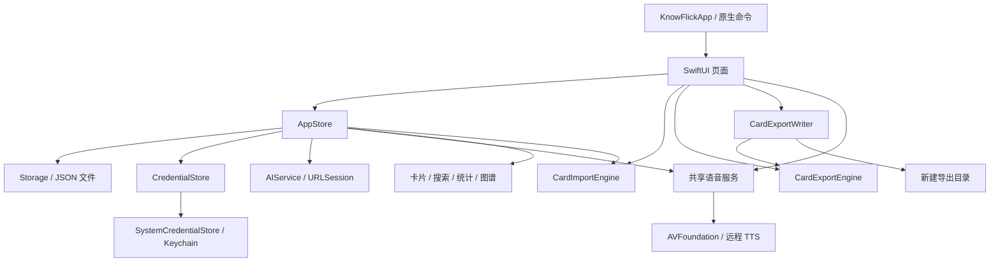

# KnowFlick 项目重新检查与优化验证

**Mode:** Health Dashboard  
**Scope:** 当前 macOS 项目，基线 `d879647` 加工作区中的导入、导出功能；46 个生产 Swift 文件、14 个 Swift 测试文件、打包和 Python 工具。保留了检查开始前已有的改动。  
**Composite Score:** 94/100（修复后、按下列有限发现集计算的结构评估；不是覆盖率或上线保证）  
**Trend:** Health Dashboard 首次记录；此前 Full Sweep 的 79 分范围不同，不作趋势比较。

| Dimension | Score | Top Finding |
|---|---:|---|
| Code Quality | 95 | 大文件读取、规则解析与导出仍在主线程执行 |
| Architecture | 95 | 播放器由共享单例提供，部分视图直接访问 |
| Tech Debt | 90 | AppStore 职责集中；存储失败缺少一致的用户反馈 |
| Test Quality | 95 | 部分 AppStore 测试共享播放器，导入重启测试仍使用默认钥匙串实现 |

每个 Warning 扣 5 分；权重依次为 25%、30%、25%、20%，加权结果 93.75 四舍五入为 94。以下五项为全部扣分项，不重复扣除已经修复的问题。

## Module Dependency Graph

SwiftPM 只有应用到 Core 的单向目标依赖，未发现目标级循环。Core 里的纯算法使用 Foundation；Mac 音频和钥匙串实现也放在 Core 内，因此它目前仍是面向 macOS 的核心模块。

## 本次发现并修复

| 问题 | 修复与证据 |
|---|---|
| JSON 归档导入默认清空 `seenAt`、`swiped`，收藏与历史丢失 | 保留所有学习状态；以固定时间、收藏、复习次数和熟练度做导出→解析→导入→落盘一致性测试 |
| 置顶导入绕过来源筛选 | 只重排正常筛选后的待刷卡片；禁用预置来源后导入预置卡不会进入待刷队列 |
| Markdown 代码块里的标题和分隔线被误拆成多张卡；含链接段落丢失；长标题截断 | 识别围栏代码块，只按最浅层标题拆卡，保留段落和完整标题；加入相应回归测试 |
| 反向出现的 `]]` / `[[` 可产生无效字符串范围 | 只查找开括号之后的闭括号；异常文本保持可读，回归测试通过 |
| Obsidian 文件名中的分类未清洗，大小写不同的同名笔记可能碰撞 | 清洗完整文件名，并按规范化、小写后的文件名去重 |
| 导出直接覆盖用户目录里的同名文件 | 每次建立独立导出子目录，文件以禁止覆盖方式写入；测试连续两次导出并验证原文件不变 |
| Markdown 目录链接和实际标题锚点不一致 | 使用显式稳定锚点，测试目录链接能对应正文位置 |
| 修改原文后仍能确认旧预览；关闭 AI 提炼窗口后旧任务继续回填 | 输入或解析方式改变时清空预览并取消任务；关闭窗口取消解析及延迟关闭任务 |
| 损坏的 JSON 会退回 Markdown 解析成为错误卡片 | 明确的 JSON 输入解析失败直接显示错误 |
| 原生“撤销滑卡”替换了编辑器的撤销命令 | 恢复系统 Undo/Redo，滑卡快捷键仅在主窗口可用；以原生输入和撤销验证 |
| 导入笔记显示为预置精选 | 卡面、详情和海报改为“导入笔记” |

以上问题按“症状→数据后果→回归用例→修复”处理，采用 brooks-health 框架审视风险；代码修改来自用户的优化授权。

## 验证证据

- 初始基线：101 项 Swift Testing 测试通过。
- 补入 6 项关键回归后：6 项均失败，覆盖历史丢失、来源筛选、Markdown 内容保留、文件名和目录锚点问题。
- 修复并增加写入保护与异常括号用例后：109 项 Swift 测试、16 个 suite 全部通过。
- `python3 -m unittest discover -s tools -p 'test_*.py'`：3 项通过。
- `git diff --check`：通过。
- 测试组合：约 78 项纯计算/配置规则测试、31 项本地存储/状态/模拟 HTTP 集成测试；自动原生 UI 测试为 0，本次另做手动原生操作验收。参数化 HTTP 用例的四个输入算一个测试声明。
- 语音 HTTP 测试使用本地模拟传输；没有调用云端 AI 或 TTS，没有据此宣称真实云端音质已验证。

## Top Findings

### Warning — R1：导入导出仍有同步主线程工作
Symptom: `ImportNotesModalView.pickFileFromDisk/parseContent` 同步读取和解析全文，`ExportCardsModalView.saveExportToDisk` 的回调同步生成并写入整个集合。  
Source: *Code Complete* — Defensive Programming；*A Philosophy of Software Design* — Information Hiding。  
Consequence: 大文件或大量卡片可能阻塞窗口；本次小规模功能验证不等同于大容量性能验证。  
Remedy: 把读取、解析和写入移至可取消的后台任务，主线程只更新预览；增加大容量场景的耗时基线。

### Warning — R5：共享语音实现穿过状态边界
Symptom: `AppStore` 和多个视图直接访问 `SpeechSynthesizerService.shared`，播放器和系统音频实现耦合。  
Source: *Clean Architecture* — Dependency Inversion；*A Philosophy of Software Design* — Information Hiding。  
Consequence: 多窗口及测试实例可能相互改变播放配置；以后替换播放实现需要同步修改多处。  
Remedy: 由应用入口创建播放器并注入 Store，视图只经同一播放接口控制。

### Warning — R2：AppStore 同时管理多个业务生命周期
Symptom: 同一个 Store 管理刷卡、收藏、导入、测验、AI 生成、聊天、配置和持久化。  
Source: *Refactoring* — Divergent Change；*The Pragmatic Programmer* — Orthogonality。  
Consequence: 新来源、导入排序或聊天行为的变更容易绕过已有数据约束；本次导入绕过筛选就是具体例子。  
Remedy: 优先抽出卡库变更与持久化边界，所有队列更新复用同一过滤规则，再分离聊天会话状态。

### Warning — R1：存储失败没有统一传播给 UI
Symptom: `Storage.saveCards` 只记录错误日志，`saveSettings` 使用 `try?`；上层可在落盘失败时仍表现为操作成功。  
Source: *Code Complete* — Defensive Programming / Explicit Error Paths。  
Consequence: 无空间或权限问题时，用户可能在重启后才发现最近修改没有保存。  
Remedy: 用明确的写入结果或抛错统一持久化接口，区分主文件失败与备份失败，并在 UI 显示可重试状态。

### Warning — T1/T2：部分集成测试依赖进程级状态
Symptom: 多个 AppStore 测试使用共享播放器；现有 CardImportEngine 重启测试只替换目录，仍使用默认凭据实现。  
Source: *xUnit Test Patterns* — Mystery Guest / Erratic Test；*The Art of Unit Testing* — Test Isolation。  
Consequence: 测试通过仍不能证明相互隔离，在音频状态或本机钥匙串不同的环境可能出现差异。  
Remedy: 在抽出播放接口后为测试使用独立播放器和内存凭据，补一条完整原生导入导出流程测试。

## Recommendation

这次优先修复了能丢内容、重置学习记录或覆盖文件的问题。下一步应先统一持久化失败反馈，再将导入导出的文件工作移出主线程。已有库中由旧解析器生成的异常标题不会自动改写；需要人工核对原笔记后修正，不能仅凭当前卡片内容猜测恢复。
